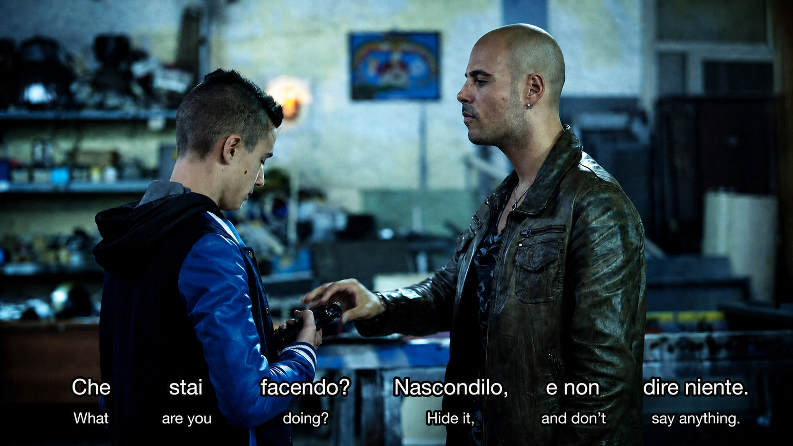
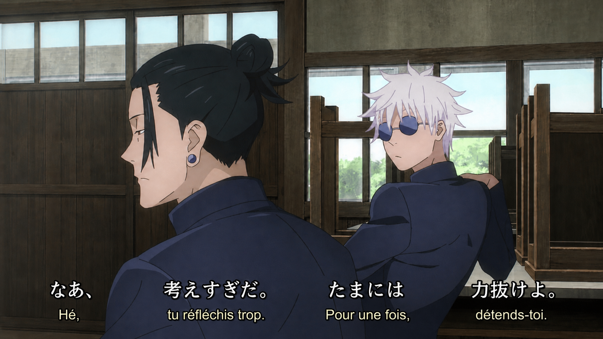
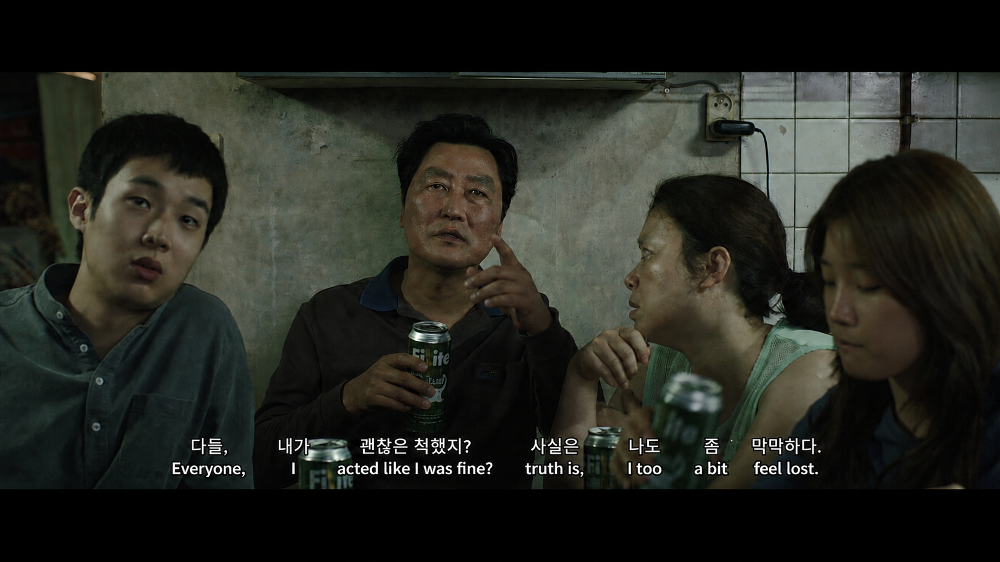
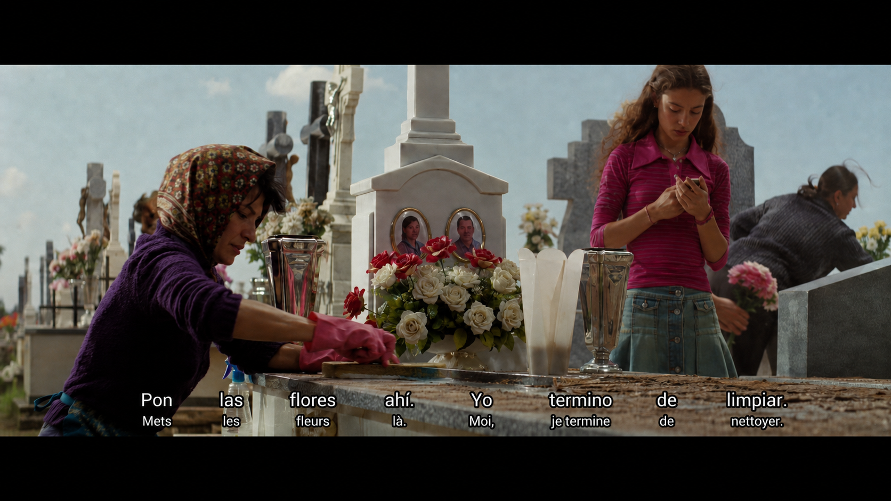

# Dual Subtitles
<p align="center">
  
  
  <br>
  
  
</p>

Dual Subtitles genere des sous-titres a partir de videos `.mp4`:

- `.srt` avec transcription Whisper;
- `.ass` avec chaque mot source au-dessus de sa traduction litterale cible;
- diarisation optionnelle des locuteurs avec pyannote.

Le pipeline est documente etape par etape dans
[docs/pipeline.md](docs/pipeline.md).

## Installation Locale

Prerequis:

- Python 3.11+;
- `ffmpeg` installe sur la machine;
- un token Hugging Face avec acces a `pyannote/speaker-diarization-3.1`;
- GPU recommande pour Whisper et pyannote.

Installation:

```bash
pip install -r requirements.txt
pip install -e .
```

Definir le token:

```bash
export HUGGINGFACE_TOKEN=your_token_here
```

Sur PowerShell:

```powershell
$env:HUGGINGFACE_TOKEN = "your_token_here"
```

Lancer le traitement:

```bash
dual-subtitles process --input-dir ./videos --output-dir ./subtitles --verbose
```

Options utiles:

```bash
dual-subtitles process --input-dir ./videos --output-dir ./subtitles --no-ass
dual-subtitles process --input-dir ./videos --output-dir ./subtitles --no-diarization
```

Les modeles ne sont charges que si une sortie doit etre generee. Lorsqu'aucun
`--temp-dir` n'est fourni, le dossier temporaire est supprime automatiquement a
la fin du traitement. L'echec d'une video est journalise sans interrompre les
autres videos du dossier.

## Developpement

```bash
pip install -e ".[dev]"
ruff check src tests
ruff format --check src tests
pytest
```

Le fichier `notebook.ipynb` est conserve comme prototype historique
Vosk/Wav2Vec. Le runner maintenu pour le pipeline actuel est
`subtitles_gen.ipynb`.

## Google Colab

Utiliser le notebook
[subtitles_gen.ipynb](subtitles_gen.ipynb).

Lien direct:
[ouvrir dans Google Colab](https://colab.research.google.com/github/git-haddadz/Dual_Subtitles/blob/master/subtitles_gen.ipynb).

Il reproduit le fonctionnement du notebook original:

1. monte Google Drive des le debut;
2. utilise `/content/drive/MyDrive/Dual_Subtitles` comme dossier du repo;
3. fait `git pull` si le repo existe deja dans Drive;
4. clone le repo uniquement s'il n'existe pas encore;
5. installe `ffmpeg` et les dependances Python;
6. demande le token Hugging Face dans une cellule;
7. traite les videos depuis `/content/drive/MyDrive/sous-titres`;
8. ecrit les `.srt` et `.ass` dans ce meme dossier.
